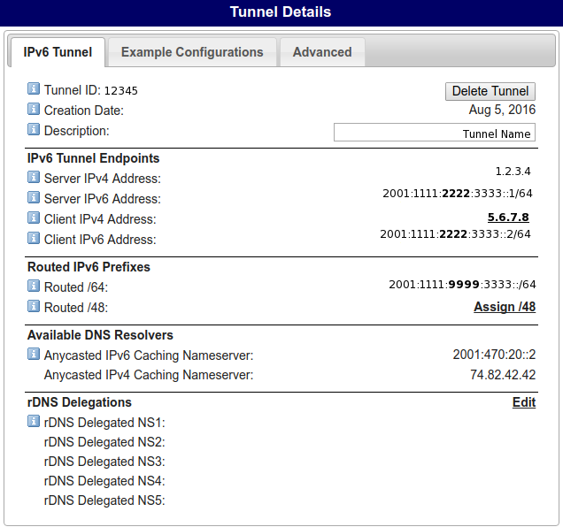
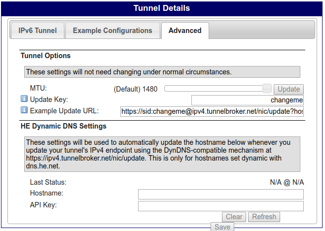

# Raspberry PI IPv6 gateway installation #

Table of Contents
=================

  * [About](#about)
  * [Before jumping down the rabbit hole](#before-jumping-down-the-rabbit-hole)
  * [Setting up the tunnel](#setting-up-the-tunnel)
  * [Installing the Operating System](#installing-the-operating-system)
    * [ArchlinuxARM](#archlinuxarm)
    * [Initial setup](#initial-setup)
    * [Setting a static IPv4 address](#setting-a-static-ipv4-address)
    * [Reboot](#reboot)
  * [Setting up the IPv6 tunnel](#setting-up-the-ipv6-tunnel)
    * [Adding the he-ipv6 device](#adding-the-he-ipv6-device)
      * [Testing the he-ipv6 device](#testing-the-he-ipv6-device)
    * [radvd](#radvd)
      * [Testing radvd](#testing-radvd)
    * [ip6tables](#ip6tables)
      * [Testing ip6tables](#testing-ip6tables)
    * [Auto-update the tunnel endpoint on a dynamic IP](#auto-update-the-tunnel-endpoint-on-a-dynamic-ip)

## About ##
This will let you set up a Raspberry PI 2 to act as an IPv6 tunnel and IPv6 DHCP server on your LAN. All your devices will automatically recieve IPv6 addresses when they connect to your LAN.

I used a Raspberry PI 2. A version 3 Pi would work too, but I felt the wifi feature wouldn't be used for the project, so why tie up my Raspberry Pi 3 for this project.

## Before jumping down the rabbit hole ##

I use fake IP addresses throughout, but I've tried to be consistent, showing the same fake IP addresses where I should. Of course any local ones (192.168.x.y) have to be modified to suit your LAN.

Furthermore, while I expect you to set up your own account on the rpi and use `sudo` as is common practice, all the commands I provide in this document should be run as `root`.

## Setting up the tunnel ##
My ISP doesn't provide IPv6 (if they did I wouldn't undertake this project). So I set up a tunnel using [Tunnelbroker](https://tunnelbroker.net). First you need to set up a tunnel.

Here are screenshots of my tunnel (with IP addresses modified).



In the `Advanced` tab, I changed the `Update Key`. This is optional



## Installing the Operating System ##

### ArchlinuxARM ###
I used [archlinuxarm](https://archlinuxarm.org/), but any linux OS which uses systemd should work, you might just have to search for package names, if they differ.

Download the OS from archlinux arm ([rpi1](https://archlinuxarm.org/platforms/armv6/raspberry-pi), [rpi2](https://archlinuxarm.org/platforms/armv7/broadcom/raspberry-pi-2), [rpi3](https://archlinuxarm.org/platforms/armv8/broadcom/raspberry-pi-3)). Follow the instructions on their `Installation` tab.

### Initial setup ###
Once the OS is installed, boot into it. If you're wired up the Pi it should automatically get an IP(v4) address. You should configure the machine's [hostname](https://wiki.archlinux.org/index.php/Network_configuration#Set_the_hostname), [timezone](https://wiki.archlinux.org/index.php/Time#Time_zone) and ensure the [clock is correct](https://wiki.archlinux.org/index.php/Time#Set_clock). Also update the system, we don't know if the installation image was out of date.
```bash
pacman -Syu
```
Install the packages listed in `package-list.txt`. Then start & enable OpenSSH and cronie:
```bash
cat package-list.txt | pacman -S -
systemctl start sshd
systemctl enable sshd
systemctl start cronie
systemctl enable cronie
```
After this, you'll most likely want to set up a user account, ssh keys and configure [sudo](https://wiki.archlinux.org/index.php/Sudo#Configuration). I'll leave this as an excercise to the reader. Don't forget to change or remove the root user's password and ensure SSH works.

### Setting a static IPv4 address ###

Set up a static IP(v4) address for the rpi on your LAN. I set this to `192.168.1.23`, but you pick yours. Copy the file `filesystem/etc/netctl/eth0-static` to `/etc/netctl/eth0-static`. Double check the values of the file to see they match your LAN. To enable this on subsequent boots: `netctl enable eth0-static`.

Alternatively you can do this on your router using the MAC address of the rpi, your choice.

### Reboot ###
Before continuing you should reboot the rpi. Check the hostname, the clock and importantly the local IP are correct.

## Setting up the IPv6 tunnel ##
Note: A lot of this came from [Setting up a Raspberry Pi as an IPv6 gateway using Hurricane Electric](www.dickson.me.uk/2013/03/15/setting-up-a-raspberry-pi-as-an-ipv6-gateway-using-hurricane-electric/). If you become confused by my instructions, that blog post may help you.

### Adding the he-ipv6 device ###
Copy `filesystem/etc/systemd/system/he-ipv6.service` to `/etc/systemd/system/he-ipv6.service`. This file contains several values you need to change, be careful;
- Change `1.2.3.4` to the `Server IPv4 Address` value on Tunnelbroker.
- Change `192.168.1.23` to the local IP of your rpi.
- Change `2001:1111:2222:3333::2/64` to the `Client IPv6 Address` value on Tunnelbroker.

Start and enable the service:
```bash
systemctl start he-ipv6
systemctl enable he-ipv6
```

#### Testing the he-ipv6 device ####
```bash
systemctl status he-ipv6
```
Ensure the final `status` command shows a green `active`. If there's an error it's most likely due to your .service file. If there is no error you should be able to run `curl jsonip.com` and see an IPv6 address in the output.

### radvd ###
Copy `filesystem/etc/radvd.conf` to `/etc/radvd.conf`. Change the `prefix` value to your `Routed /64` value.
```bash
systemctl start radvd
systemctl enable radvd
```

#### Testing radvd ####
```bash
systemctl status radvd
```
Again, check the `status` command doesn't show any errors.

### ip6tables ###

Copy `filesystem/etc/iptables/ip6tables.rules` to `/etc/iptables/ip6tables.rules`.
```bash
systemctl start ip6tables
systemctl enable ip6tables
```

#### Testing ip6tables ####
Check that `ip6tables -L -v -n` has a bunch of output.

Connect a new device to your LAN (for example, disconnect your phone from the wifi and reconnect). Check that it can use IPv6. For example browse to https://jsonip.com or try connecting to https://ipv6.google.com. If it can, then you're good to go.

### Auto-update the tunnel endpoint on a dynamic IP ###
If you have a dynamic IPv4 address provided by your ISP (most peoply do), then you'll need to update the `Client IPv4 address` on Tunnelbroker. On the `Advanced` tab of the tunnel configuration you will see an `Example Update URL` provided by Tunnelbroker. Copy this value into your crontab:
Open the crontab editor
```bash
cron -e
```
Set your tunnel to update every 10 minutes (for instance):
```
*/10 * * * * curl -s 'https://<username>:<tunnel-token>@ipv4.tunnelbroker.net/nic/update?hostname=<tunnel-id>' &> /dev/null
```
The `cronie` service is already running as it was enabled earlier.
